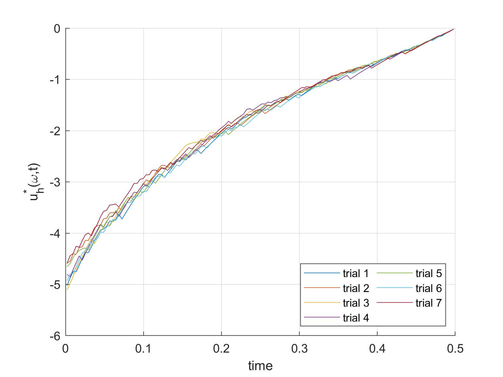
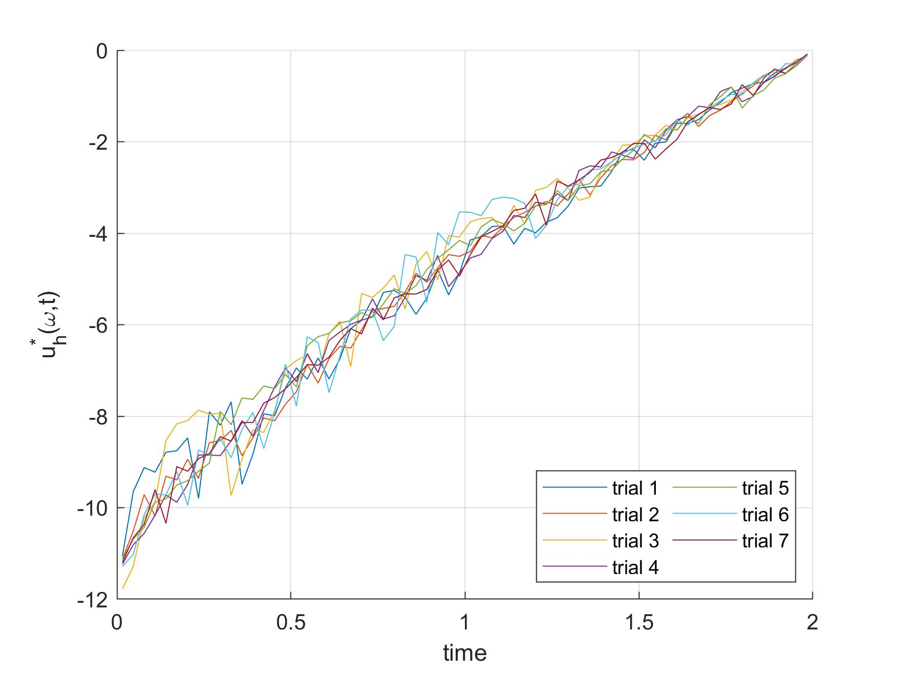
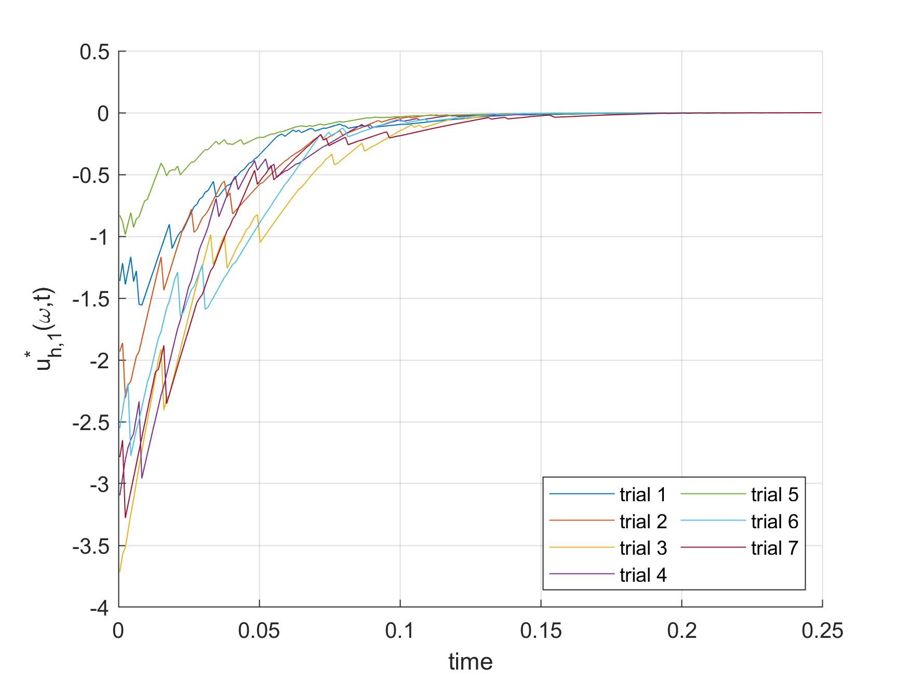
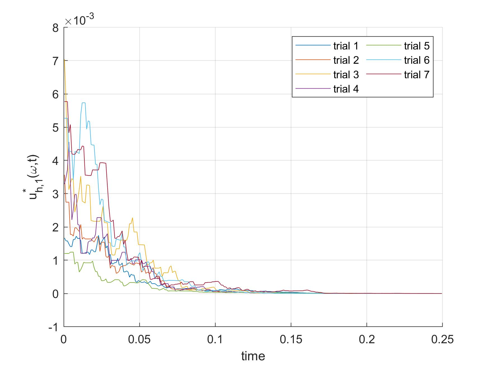

# The Random Batch Method in Linear Quadratic Optimal Control
A Matlab implementation of the Random Batch Method (RBM) in Linear Quadratic (LQ) optimal control problems. 
The examples are the same as the ones as in [this paper](https://link.springer.com/article/10.1007/s00211-022-01290-3). 
More information can also be found in [this post](https://dcn.nat.fau.eu/random-batch-methods-for-linear-quadratic-optimal-control-problems/) and in [this post](https://dcn.nat.fau.eu/randomized-time-splitting-in-linear-quadratic-optimal-control/). 

### Main features
* A gradient-based solver for optimal control problems constrained by Random Batch Dynamics. 
* Plotting of the obtained optimal controls and state trajectories.

### Considered examples
The code 
* Example 1: A heat equation on a 1-D spatial domain 
* Example 2: A heat equation on a 3-D spatial domain 
* Example 3: A fractional heat equation in 

The code can be executed by running the files [example1_heat1D](example1_heat1D), [example2_heat3D](example2_heat3D), and [example3_fractional3D](example3_fractional3D). Figures 1, 2, and 3 show the typical results. Note that the specific plots depend on the randomly selected vector of indices \boldsymbol \omegaω, and that the specific solutions will be different every time than the files are executed.

Figure 1: RBM controls obtained by running [example1_heat1D](example1_heat1D).

Figure 2: RBM controls obtained by running [example2_heat3D](example2_heat3D).

Figure 2: RBM controls obtained by running [example3_fractional3D](example3_fractional3D).
